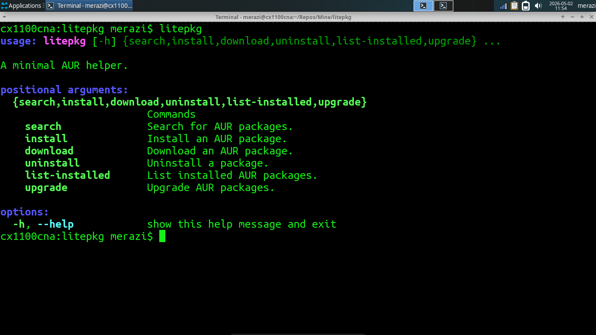

# The litepkg AUR helper

Hey everyone!

I wanted to share with you that I've written a python script that can help you download, install, uninstall and upgrade your AUR packages.

It's called "litepkg" and it's available on my github:

[litepkg on GitHub](https://github.com/merazi/litepkg)

Here's the obligatory screenshot!

# Roadmap

- Implement an "info" function that lets you retrieve package metadata, things like the description, upstream url and such.
- Make it so package names can be autocompleted with bash completion (I have to figure out how to do that).
- I'll probably build an AUR package for this in the future.
