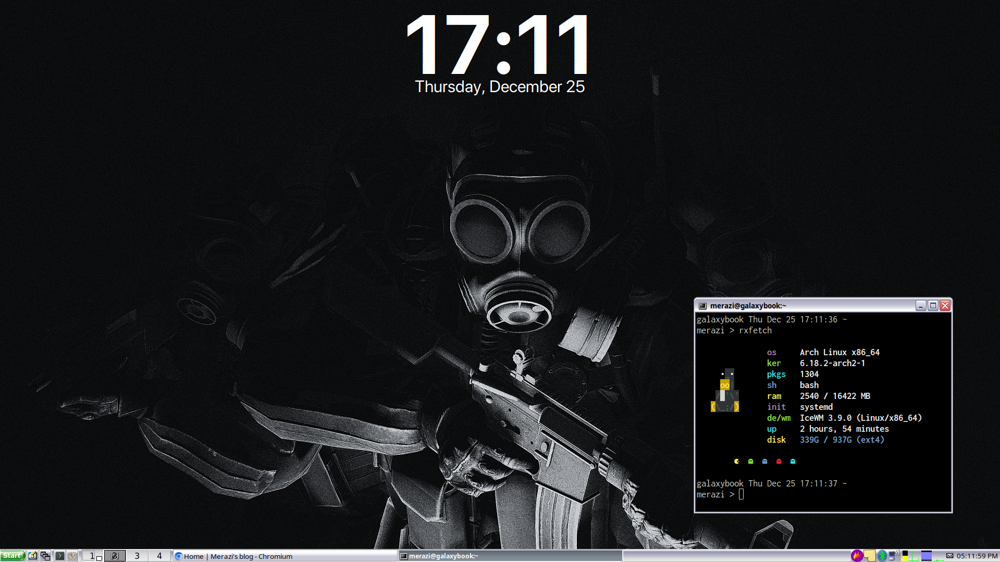

I recently switched my desktop environment from XFCE4 to the IceWM window manager, and I wanted to share my experience. This isn't a critique of XFCE4; it's a fantastic and reliable environment. Instead, this is about my desire to explore a more lightweight and modular setup.

I've experimented with IceWM before but never committed to it as my daily driver. This time, I decided to do a clean install and build my environment from the ground up.

### The Fresh Start: Removing XFCE4

To ensure a clean slate, the first thing I did was completely remove the existing XFCE4 environment and the LightDM display manager.

```sh
# Remove the entire xfce4 group and its dependencies
sudo pacman -Rncs xfce4

# Disable and stop the LightDM service
systemctl disable lightdm
systemctl stop lightdm

# Remove the LightDM package
sudo pacman -Rncs lightdm
```

After a reboot, I was left with a minimal command-line interface, ready for the new setup. I also made sure I had `xorg-xinit` installed to be able to start a graphical session with the `startx` command.

### Core Installation: Getting IceWM Running

With the old environment gone, it was time to install IceWM. I started with two packages.

1.  **`icewm`**: The main window manager from the official Arch Linux repositories.
2.  **`icewm-extra-themes`**: A collection of additional themes from the Arch User Repository (AUR) for more customization options.

### Personalizing the Environment

With IceWM installed, the next step was to configure it to my liking.

#### Launching the Session

To automatically launch applications when IceWM starts, it's best to use `icewm-session`. I created a `~/.xinitrc` file with the following line to make this my default startup command:

```sh
exec icewm-session
```

Using `icewm-session` allows IceWM to execute a startup script, which is perfect for launching background services and other applications. You can find more details in the [official documentation](https://ice-wm.org/man/icewm-startup.html).

#### The Startup Script

Following the documentation, I created a script at `~/.config/icewm/startup`. It's a simple shell script that launches everything I need for a complete desktop experience.

```sh
#!/bin/bash

# System tray applets
nm-applet &      # Network Manager
blueman-applet & # Bluetooth Manager
pnmixer &        # Sound Manager

# Services
dunst &          # Notification daemon
xcompmgr &       # Compositor for effects like transparency
xpad &           # Sticky notes

# Terminal and UI configuration
xrdb -load ~/.Xresources # Load settings for xterm and other X apps

# System monitor and wallpaper
sleep 1 && conky -c ~/.config/conky-date-widget &
icewmbg --center=1 -i ~/Pictures/1071432.png
```

I prefer using the built-in `icewmbg` utility for setting the wallpaper. It's lightweight and means I don't need to install other tools like `feh` or `nitrogen`.

### Application Launcher: A Dynamic Menu

For a dynamic application menu that automatically updates, I used `xdg-menu`. The [ArchWiki has a great guide](https://wiki.archlinux.org/title/Xdg-menu#IceWM) on how to set this up, and it was surprisingly straightforward.

### Final Result

Here is a screenshot of my setup so far. I'm still tweaking things and exploring the possibilities, but I'm already enjoying the speed and simplicity of IceWM. I'll be sure to share any new discoveries in future posts!

:-)


